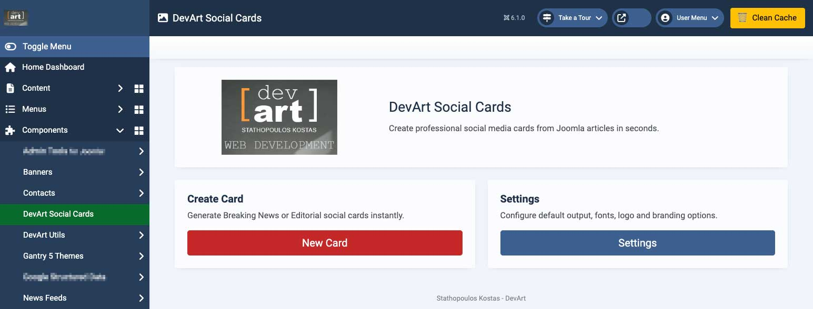
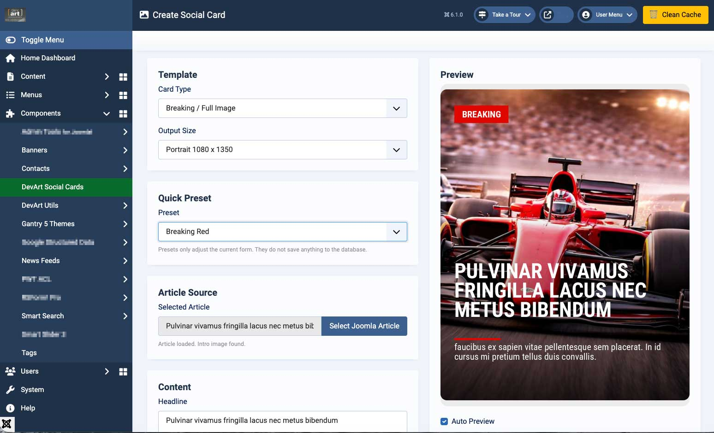
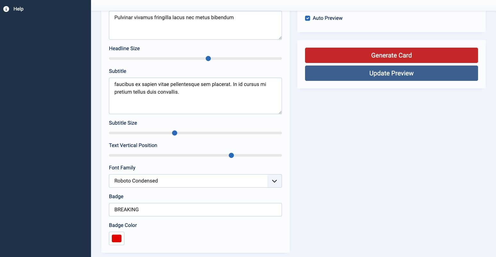
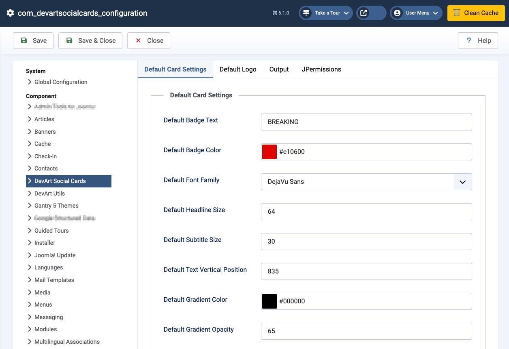
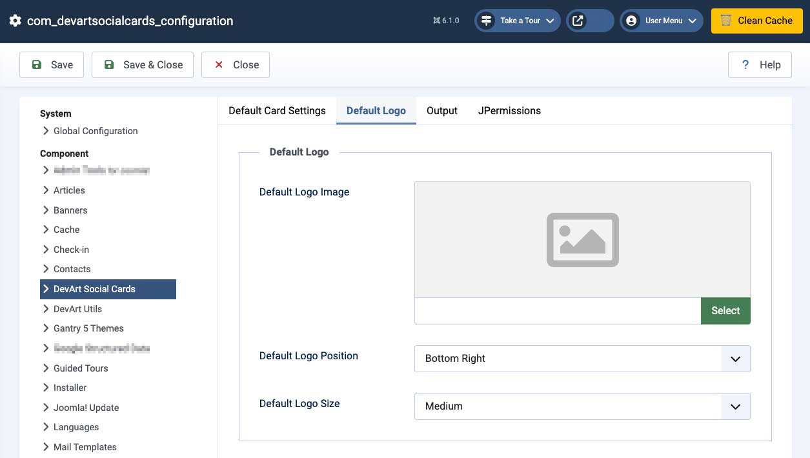
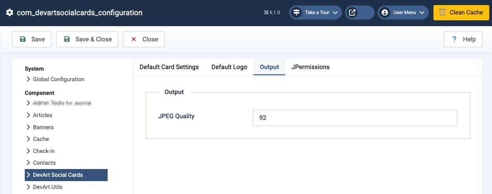
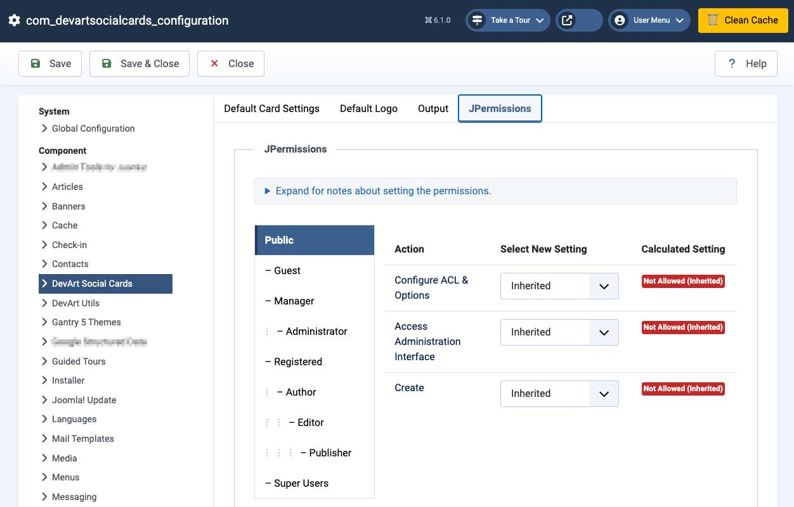
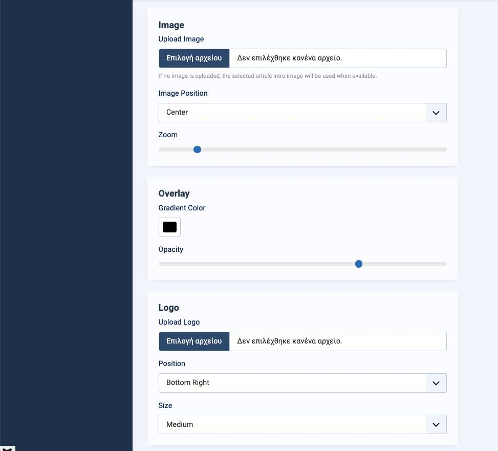

# DevArt Social Cards for Joomla


Professional social media card generator for Joomla 6.

Create stunning Breaking News, Editorial, Sports and Facebook-ready social cards directly from Joomla articles in seconds.

---

## 🚀 Latest Release

**Version:** 1.1.3

### Highlights

- GitHub-based update server
- Fully compatible with Joomla Update System and JED requirements
- Stable rendering engine across all templates
- Production-ready release for high-traffic Joomla sites

---

## ✨ Features

✅ Generate professional social media cards instantly  
✅ Select Joomla article directly with Article Picker  
✅ Auto load Joomla article title and intro image  
✅ Live preview rendering system  
✅ Auto Preview mode  
✅ Multiple modern templates  
✅ Custom badge text and colors  
✅ Logo upload and default logo support  
✅ Safe Reset for design settings only  
✅ JPEG quality settings  
✅ Upload size guard  
✅ Pixel dimension guard  
✅ Lightweight optimized package  
✅ Joomla 6 native component  
✅ GitHub-based Joomla Update Server integration  
✅ GPL Open Source  

---

## 🎨 Templates

Includes multiple ready-to-use templates:

- Breaking / Full Image
- Clean Editorial
- Clean Horizontal Line
- Top Logo Text
- 6 additional modern templates

Designed for:

- News sites
- Sports portals
- Political content
- General media and blogs

---

## 📐 Output Formats

- 1080 x 1350 - Instagram Portrait
- 1080 x 1080 - Square
- 1200 x 630 - Facebook Link Preview
- 1200 x 800 - Landscape

---

## ⚙️ Core Functionality

### Article Integration

- Direct Joomla Article Picker
- Auto-fetch title and intro image
- Fast content-to-card workflow

### Rendering Engine

- GD-based image generation
- Custom font rendering
- Template-based positioning system
- Live preview and export

### Design Controls

- Text positioning
- Font sizing
- Colors and accents
- Logo placement
- Template presets

---

## 📸 Screenshots

### Dashboard



### Create Card



### Article Picker / Live Preview



### Settings - Default Card Settings



### Settings - Default Logo



### Settings - Output



### Settings - Permissions



### More Preview



---

## 📦 Installation

1. Download latest release ZIP.
2. Go to Joomla Administrator → System → Install Extensions.
3. Upload:

```text
com_devartsocialcards_v1.1.3.zip
```

4. Open:

```text
Components → DevArt Social Cards
```

---

## 🔄 Updates

Supports Joomla native update system via GitHub:

```text
https://raw.githubusercontent.com/devartgr/joomla-devart-social-cards/main/update.xml
```

---

## 🧪 Requirements

- Joomla 6.x
- PHP 8.1+
- GD Library enabled

---

## 🔐 Security

- CSRF protection on all actions
- Image upload validation for JPG, PNG and WEBP
- File size and dimension limits enforced

---

## 📄 License

GNU GPL v3

---

## 👨‍💻 Developer

**Stathopoulos Kostas – DevArt**  
https://devart.gr

---

## ⚡ Roadmap

- Additional templates
- Typography improvements
- Advanced layout engine
- Potential commercial features
